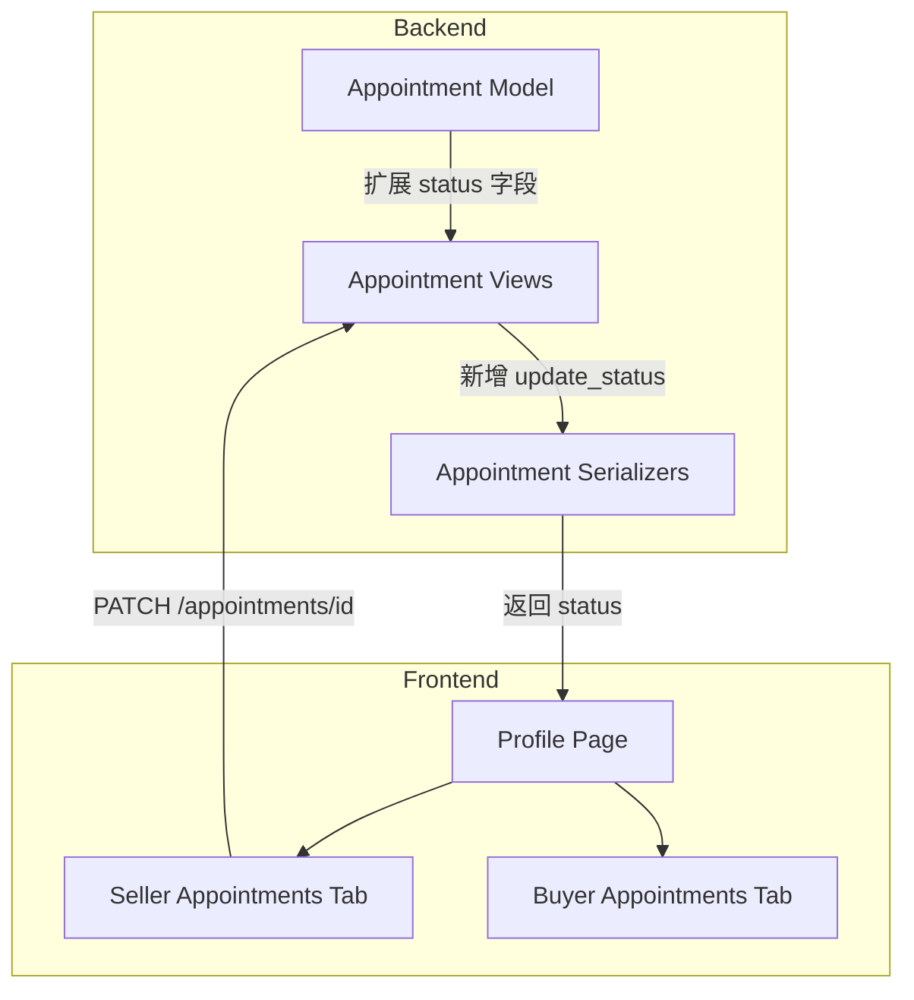
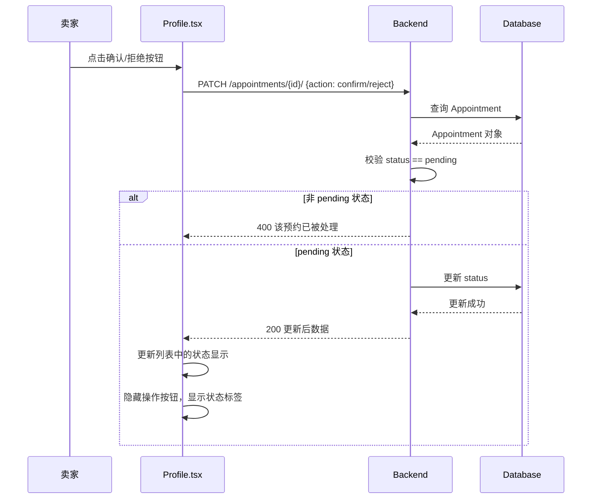

# Design Document

## Overview

**Purpose**: 为现有预约系统补充卖家确认/拒绝机制，使预约从"单向通知"升级为"双向确认"流程。
**Users**: 卖家在个人中心处理预约；买家查看预约状态。
**Impact**: 修改 Appointment 模型增加 status 字段；新增 PATCH 端点；前端 Profile 页两个 tab 增加交互。

### Goals
- 卖家可确认或拒绝 pending 状态的预约
- 买家可看到预约状态（待确认/已确认/已拒绝）
- 已处理的预约不可重复操作

### Non-Goals
- 管理员代操作预约
- 预约状态之外的订单/交易流程
- 通知/消息推送

## Boundary Commitments

### This Spec Owns
- Appointment 模型的 status 字段及状态枚举
- 卖家更新预约状态的 API 端点
- 前端 Profile 页卖家/买家预约列表的状态显示和操作按钮

### Out of Boundary
- 管理员预约管理（AdminLayout 不变）
- 商品详情页预约按钮逻辑（ProductDetail.tsx 不变）
- 预约创建流程（create_appointment 不变）
- 通知系统

### Allowed Dependencies
- 现有 Appointment 模型（扩展，不重构）
- 现有 Token 认证中间件
- 现有 request 工具函数

### Revalidation Triggers
- Appointment 模型字段变更（影响序列化器）
- 预约状态枚举扩展（影响前端状态映射）
- 认证中间件变更（影响权限检查）

## Architecture

### Existing Architecture Analysis

当前预约系统结构：
- **Model**: `Appointment(buyer, product, created_at)` — 无状态字段
- **Views**: `create_appointment` (POST), `my_appointments_as_buyer` (GET), `my_appointments_as_seller` (GET)
- **Serializers**: `AppointmentCreateSerializer` (product_id), `AppointmentListSerializer` (id, product_id, product_title, product_price, buyer_username, created_at)
- **Frontend**: Profile.tsx 两个 tab 展示预约列表，卖家 tab 无操作按钮

### Architecture Pattern & Boundary Map



### Technology Stack

| Layer | Choice / Version | Role in Feature |
|-------|------------------|-----------------|
| Backend | Django 4.1 + DRF | 模型扩展、新增端点 |
| Frontend | React 19 + TypeScript | 状态显示、操作按钮 |
| Database | MySQL 5.7 | status 字段存储 |

## File Structure Plan

```
backend/apps/appointments/
├── models.py              # 扩展：增加 status 字段和 CHOICES
├── serializers.py         # 扩展：AppointmentListSerializer 增加 status；新增 AppointmentUpdateSerializer
├── views.py               # 扩展：新增 update_appointment_status 视图
└── urls.py                # 扩展：注册 PATCH 路由

frontend/src/
├── types/index.ts         # 扩展：AppointmentItem 增加 status 字段
└── view/profile/Profile.tsx # 扩展：卖家 tab 增加确认/拒绝按钮；买家 tab 增加状态标签
```

### Modified Files
- `backend/apps/appointments/models.py` — 增加 `status` CharField（choices: pending/confirmed/rejected），默认 pending
- `backend/apps/appointments/serializers.py` — `AppointmentListSerializer` 增加 status 字段；新增 `AppointmentUpdateSerializer`
- `backend/apps/appointments/views.py` — 新增 `update_appointment_status` 视图（PATCH）
- `backend/apps/appointments/urls.py` — 注册 `PATCH appointments/<id>/` 路由
- `frontend/src/types/index.ts` — `AppointmentItem` 接口增加 `status: string`
- `frontend/src/view/profile/Profile.tsx` — 卖家 tab 增加确认/拒绝按钮；买家 tab 增加状态标签

## System Flows

### 卖家确认/拒绝流程



## Components and Interfaces

| Component | Domain | Intent | Req Coverage | Key Dependencies | Contracts |
|-----------|--------|--------|--------------|------------------|-----------|
| Appointment Model | Backend/Data | 存储预约状态 | 1.1, 1.2, 1.3 | Product, User | State |
| AppointmentUpdateSerializer | Backend/API | 校验状态更新请求 | 2.1, 3.1 | Appointment Model | API |
| update_appointment_status | Backend/API | 处理状态变更 | 2.1, 2.2, 2.3, 3.1, 3.2, 3.3 | AppointmentUpdateSerializer | API |
| AppointmentListSerializer | Backend/API | 返回预约数据含 status | 4.1, 5.1 | Appointment Model | API |
| Profile Seller Tab | Frontend/UI | 卖家操作预约 | 2.1, 2.4, 5.1, 5.2, 5.3 | request util | Service |
| Profile Buyer Tab | Frontend/UI | 买家查看状态 | 4.1, 4.2, 4.3, 4.4, 4.5 | request util | Service |

### Backend

#### Appointment Model Extension

| Field | Detail |
|-------|--------|
| Intent | 为预约记录增加状态追踪 |
| Requirements | 1.1, 1.2, 1.3 |

**State Management**
- State model: pending → confirmed / pending → rejected
- Persistence: MySQL status 字段，带 choices 约束
- Concurrency: 单写（卖家操作），乐观校验 status == pending

#### update_appointment_status View

| Field | Detail |
|-------|--------|
| Intent | 卖家更新预约状态 |
| Requirements | 2.1, 2.2, 2.3, 3.1, 3.2, 3.3 |

**API Contract**

| Method | Endpoint | Request | Response | Errors |
|--------|----------|---------|----------|--------|
| PATCH | /api/appointments/{id}/ | `{action: "confirm" \| "reject"}` | Appointment 含 status | 400 (非pending), 403 (非卖家), 404 |

- Preconditions: 用户已认证，是该预约对应商品的卖家，预约状态为 pending
- Postconditions: status 变更为 confirmed 或 rejected
- Invariants: 非 pending 状态不可操作

### Frontend

#### Profile Seller Tab Extension

| Field | Detail |
|-------|--------|
| Intent | 卖家查看预约并执行确认/拒绝操作 |
| Requirements | 2.1, 2.4, 5.1, 5.2, 5.3 |

**Responsibilities & Constraints**
- 展示预约列表，每条显示状态标签
- pending 状态显示"确认"和"拒绝"按钮
- confirmed/rejected 状态隐藏按钮，仅显示标签
- 操作成功后立即更新本地状态

#### Profile Buyer Tab Extension

| Field | Detail |
|-------|--------|
| Intent | 买家查看预约状态 |
| Requirements | 4.1, 4.2, 4.3, 4.4, 4.5 |

**Responsibilities & Constraints**
- 为每条预约显示状态标签：待确认/已确认/已拒绝
- 无操作按钮（只读）

## Data Models

### Appointment Model Extension

```python
# 新增字段
status = models.CharField(
    max_length=10,
    choices=[("pending", "待确认"), ("confirmed", "已确认"), ("rejected", "已拒绝")],
    default="pending",
)
```

- 无新表，修改现有 Appointment 表
- 数据迁移：现有记录默认 pending（兼容）

## Error Handling

| 错误场景 | HTTP Code | 消息 |
|----------|-----------|------|
| 非卖家操作 | 403 | 无权操作 |
| 预约不存在 | 404 | 预约不存在 |
| 非 pending 状态操作 | 400 | 该预约已被处理 |
| action 参数无效 | 400 | 参数错误 |

## Requirements Traceability

| Requirement | Summary | Components | Interfaces | Flows |
|-------------|---------|------------|------------|-------|
| 1.1 | 创建时默认 pending | Appointment Model | — | — |
| 1.2 | 三种状态枚举 | Appointment Model | — | — |
| 1.3 | 记录变更时间 | Appointment Model | updated_at 字段 | — |
| 2.1 | 卖家确认预约 | update_appointment_status | PATCH /appointments/{id}/ | 确认流程 |
| 2.2 | 操作成功提示 | Profile Seller Tab | toast | — |
| 2.3 | 非 pending 拒绝操作 | update_appointment_status | 400 错误 | — |
| 2.4 | 立即更新显示 | Profile Seller Tab | 本地状态更新 | — |
| 3.1 | 卖家拒绝预约 | update_appointment_status | PATCH /appointments/{id}/ | 拒绝流程 |
| 3.2 | 操作成功提示 | Profile Seller Tab | toast | — |
| 3.3 | 非 pending 拒绝操作 | update_appointment_status | 400 错误 | — |
| 4.1 | 买家看状态标签 | Profile Buyer Tab | — | — |
| 4.2 | pending 显示待确认 | Profile Buyer Tab | — | — |
| 4.3 | confirmed 显示已确认 | Profile Buyer Tab | — | — |
| 4.4 | rejected 显示已拒绝 | Profile Buyer Tab | — | — |
| 4.5 | 按时间倒序 | AppointmentListSerializer | ordering | — |
| 5.1 | 卖家看状态标签 | Profile Seller Tab | — | — |
| 5.2 | pending 显示按钮 | Profile Seller Tab | — | — |
| 5.3 | 非 pending 隐藏按钮 | Profile Seller Tab | — | — |

## Testing Strategy

### Unit Tests
- Appointment model: status 默认值、choices 约束
- update_appointment_status: 卖家确认成功、非卖家 403、非 pending 400
- AppointmentListSerializer: status 字段序列化

### Integration Tests
- 创建预约 → 默认 pending → 卖家确认 → 状态变 confirmed
- 创建预约 → 卖家拒绝 → 状态变 rejected → 再操作返回 400
- 买家预约列表包含 status 字段

### E2E Tests
- 卖家在 Profile 看到 pending 预约 → 点击确认 → 按钮消失，显示已确认
- 买家在 Profile 看到预约状态为已确认
